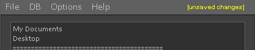
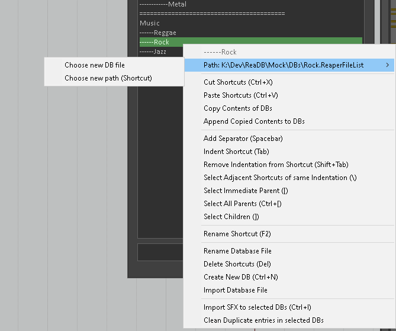
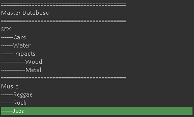
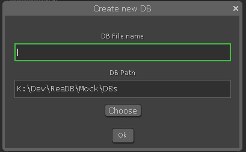
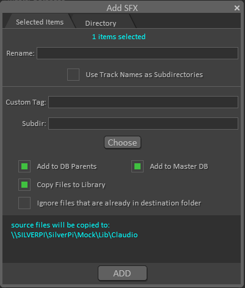
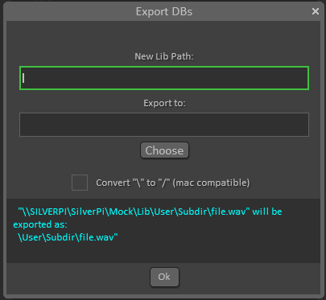

# DBManager Help

## About

DBManager is a tool designed to help organize and maintain Reaper Media Explorer Databases. It can help you import and export databases, add sounds to multiple databases at once and perform basic maintenance tasks such as removing duplicates and redirecting paths to a new location in the event of a library move.

## Core Reaper Database mechanics

Reaper databases are lists of files stored in plain text format. The software uses the .ReaperFileList extension to identify databases and it stores metadata and basic file information along with the filepath for fast searching. 

Reaper stores a list of database files to include in the media explorer sidebar in the reaper.ini configuration file, under the reaper_explorer/reaper_sexplorer section. There it references each database usingthe following format:

```
Shotcut[n]=pathToDB.ReaperFileList
ShortcutT[n]=nameOfDBONSidebar
```

[n] = index of the database in the media explorer list. Determines ordering
pathToDB.ReaperFileLIst = path to database file. Can be relative if file is inside the MediaDB folder in the Reaper resources path. Otherwise accepts a full path that can point to network shares or any other valid location.
nameOfDBOnSidebar = name to be displayed on the Media Explorer list. 

Reaper reads this section of the ini when it first opens the media explorer, and then keeps it in memory. Any changes made to this list after it's been stored in memory won't be visible until reaper re-starts. 

The database entries themselves follow the following format:

```
PATH "directory path for auto scans without trailing slash"
FILE "filePath" size 0 secondsFrom1970
DATA "t:Title" "d:Description" "a:Artist" "b:Album" "y:Year" "g:Genre" "u:Custom tag" "c:Comment"
```

The only field that can be edited from within Media Explorer is the "Custom Tag", all others represent static metadata tags embedded on the sound files.

The most important thing to note in the way the database system works is the fact that every database entry is completely independent from the others and from all other databases. That means duplicate entries can be created on the same list. It also means that if you delete an entry from one database it will not be automatically removed from other databases that may contain that entry. 

Since filepaths are also written in absolute form the database files are not cross-platform since unix and windows systems use different path naming standards. 

## DBAssistant

DBAssistant is a command line utility bundled with DBManager that handles all the file operations and the scanning of files to be added to databases. It was written to work as the backend for the DBManager and accepts most of it's commands parameters in a json format. It can also be used manually from the command line though. For more information on how to do that please check the help page on DBAssistant by running dbassistant.exe --help (or dbassistant --help if you are on a unix system).

### Metadata extraction

DBAssistant extracts metadata from sound files in order to add tags to the database entry. It is capable of extracting the following types of metadata:

bext
RIFF-INFO
ixml
id3 tags
exif
vorbis

It will attempt to read all of these tags and fill the metadata fields with the first applicable tag found. Since the use of different tags is very non standardized among different sound effects and sample library producers DBAssistant accepts different tags for the same field, using an arbitrary hierarchy to determine the most appropriate entry. For example, the "Artist" field for an entry might be filled with any of the following, stopping at the first tag found:

INFO - IART
INFO - IENG
iXML - MediaArtist
iXML - AudioSoundEditor
iXML - AudioActor
iXML - AudioSoundMixer
ID3, Exif or Vorbis - artist

The "Comment" field on the database is used to record the user that added the entry to the database and ignores the read metadata completely.

## Configuration

DBManager uses a json config file to store it's user configurations. On startup it looks for a file named "config.json" on the same directory as DBManager.lua. If it can't find one it will prompt the user to import or generate a configuration. The json file contains the following fields:

```
{
    "library": "string pathToDirectory",
    "masterDB": "string pathToDatabase",
    "users": ["array","of","usernames"],
    "databases": "string pathToDirectory"
}
```

- library: this should point to the root directory of the sound library where most sound files should be stored. It is used to determine where files will be copied to when added to the library, as a destination for the history logs of additions and the origin path when exporting databases for portable use.
- databases: this should point to the directory where you would like to store the .ReaperFileList database files. It is used mostly as a convenient default path for new databases.
- users: this is a list of users to be displayed in the user selector inside DBManager. When sounds are added to a library the user responsible is recorded on the "Comments" field of metadata. The user name is also used to determine where files should be copied to in the absence of any user selected subdirectories.
- masterDB: this points to a .ReaperFileList database file that should be used as a "master" database. By default all additions to any database are also added to the masterDB so it is possible to search for all sounds in the media explorer using this database. This behaviour can be overriden in the Add SFX dialog.

A template of the config file can be found in the Documentation folder in the DBManager script folder.

## Interface

### Saving changes to .ini

Changes that affect the reaper.ini are not instantly saved to the file. Any changes that add/remove or alter the list of databases or the paths to their respective .ReaperFileList files affect the .ini and therefore need to be saved before taking effect. The save option can be found on the "File -> Save Changes to Profile" menu option. DBManager displays a warning on the top right corner when there are unsaved changes.



### Search

The Search bar can be found at the bottom of the interface. Use it to search for databases in long lists

### Keyboard Shortcuts

| Shortcut | Action |
|---: | :---:|
| <kbd>Esc</kbd> | (With subwindow open) Close dialogue |
| <kbd>Ctrl</kbd>+<kbd>Z</kbd>| Undo|
| <kbd>Ctrl</kbd>+<kbd>Shift</kbd>+<kbd>Z</kbd>| Redo|
| <kbd>Ctrl</kbd>+<kbd>X</kbd> | Cut Shortcuts |
| <kbd>Ctrl</kbd>+<kbd>V</kbd> | Paste Shortcuts |
| <kbd>Spacebar</kbd> | Add Separator |
| <kbd>Tab</kbd> | Indent Shortcut |
| <kbd>Shift</kbd>+<kbd>Tab</kbd> | Remove Indentation from Shortcut |
| <kbd>F2</kbd> | Rename Shortcut |
| <kbd>Del</kbd> or <kbd>Backspace</kbd> | Delete Shortcuts |
| <kbd>\\</kbd> | Select Adjacent Shortcuts of same Indentation |
| <kbd>[</kbd> | Select Immediate Parent |
| <kbd>Ctrl</kbd>+<kbd>[</kbd> | Select All Parents |
| <kbd>]</kbd> | Select Children |
| <kbd>Ctrl</kbd>+<kbd>N</kbd> | Create New DB |
| <kbd>Ctrl</kbd>+<kbd>I</kbd> | Import SFX to selected DBs |
| <kbd>↑</kbd> | Select previous shortcut(s) |
| <kbd>↓</kbd> | Select next shortcut(s) |
| <kbd>Shift</kbd>+<kbd>↑</kbd> | Expand selection up |
| <kbd>Shift</kbd>+<kbd>↓</kbd> | Expand selection down |
| <kbd>Ctrl</kbd>+<kbd>↑</kbd> | Move selected shortcuts up |
| <kbd>Ctrl</kbd>+<kbd>↓</kbd> | Move selected shortcuts down |
| <kbd>Esc</kbd> | (Shortcut List Focused) Shrink selection |
| <kbd>Enter</kbd> | (Search Bar Focused) Perform Search |

## Shortcuts

The sidebar of the Media Explorer contains a list of Shortcuts. Each points to either a path or to a database. Search is optimized in databases. 

Each Shortcut consists of a name, which is displayed in Media Explorer, and a path. The path can be relative when pointing to a database inside the MediaDB folder in the Reaper Resources path or an absolute path to a folder or .ReaperFileList file.

### Importing Database Files

You can import existing database files into your list by selecting "File -> Import Database Files". The imported database will be named after the database file name. It can then be renamed with f2 or "right click -> rename shortcut"

### Importing/Exporting Shortcuts

DBManager can export groups of shortcuts that can be later imported by DBManager. This can be used to create different sets of Shortcuts for different purposes, to share shortcut lists with other people in the same studio or as a way of backing up your shortcuts. To do so go to "File -> Export Selected Shortcuts". 

In order to import the shortcut bundle you can either "Import Shortcut Bundle (Replace All)", which will replace your list with the imported one, or "Import Shortcut Bundle (Insert)", which will insert the imported shortcuts underneath the selected point in the list. 

### Editing Shortcut list

The list of shortcuts can be edited using the keyboard or the mouse. Shortcuts can be:

- Moved up and down using <kbd>Ctrl</kbd>+<kbd>↑</kbd> and <kbd>Ctrl</kbd>+<kbd>↓</kbd>
- Cut and Pasted using <kbd>Ctrl</kbd>+<kbd>X</kbd> and <kbd>Ctrl</kbd>+<kbd>V</kbd>
- Deleted using <kbd>Delete</kbd> or <kbd>Backspace</kbd>
- Renamed USING <kbd>f2</kbd>
- Actions can be undone/redone using <kbd>Ctrl</kbd>+<kbd>z</kbd> and <kbd>Ctrl</kbd>+<kbd>Shift</kbd>+<kbd>z</kbd>
- Separators can be added with <kbd>Spacebar</kbd>. Separators are simply shortcuts pointing to an empty database with the name "=========================================", which looks like a horizontal separator

### Pointing Shortcuts to new path or DB



Right clicking a shortcut will give you the option to change the path/database it points to. 

### Shortcut Hierarchy (a.k.a folders)



DBManager artifially creates hierarchies between databases using indentation. In the example above "Wood" and "Metal" are children of "Impacts", which is itself a child of "SFX". These relationships are used when adding sounds to the databases. When adding sounds to a child database you can opt to also add it to all of it's parents. Keep in mind this is an arbitrary feature of DBManager that is in no way embedded into the databases. When adding sounds from Media Explorer itself it will completely ignore all relationships between databases since it doesn't recognize the naming pattern. 

Parent/Child relationships can also be used to create complex selections while editing the shortcut list. Right click a database to see the possible selections. 

### Creating new Database



New Databases can be created by selecting a spot in the list and pressing <kbd>Ctrl</kbd>+<kbd>N</kbd>. In the Dialogue above the first input box requires the name desired for the new database file and shortcut and the second determines where the file will be created. If a file with the chosen name already exists in the target directory a number sufix will be added to it to ensure uniqueness.

## Database Operations

### Adding Sounds to Database



Adding sounds to databases is one of the main features of DBManager. It can be used to add sounds from your timeline or from a specific directory in the file system to one or more databases at once. 

#### Adding sounds from the timeline

With DBManager open you can select one or more clips from the Reaper timeline and add them to databases. By default the sound files won't be glued or renamed on import so what will be added is actually the source of the clip. If you wish to trim the sound added to what the clip currently encompasses on the timeline don't forget to first glue/render the clips in order to create new sources. 

DBManager is capable of renaming sources on import though. To do so specify a new name on the "Rename" box and imported files will be renamed accordingly. In order to prevent conflict a numeral sufix will be added to the files, resulting in:

```
newName.wav
newName_01.wav
newname_02.wav
...
```

Track names on the timeline can also be used as subdirectories for more complex library organization. Clips will then be placed in subdirectories in the library matching the track names that contained them in the timeline.

#### Adding sounds from a directory

When adding sounds from a directory DBManager will scan the given directory and attempt to add all sound files found in the directory and recursively in any subdirectories. When copied to the library the folder structure will be maintained so a similar directory will be found in the library containing only sound files.

#### Subdirs and user folders

When adding sounds you can specify a subdirectory in which to copy the files inside the library through the "Subdir" input box. In the absence of a subdirectory specified like this or through the option "Use track names as subdirectories" sounds will be added to a folder named after the user currently using DBManager (as specified in Options).

This only changes the way filename conflicts will be handled. Files copied into the user folder will always be copied with a sufix for uniqueness in case of name conflict. Files copied into subdirectories on the other hand will not be copied if a file with the same name already exists in the subdirectory and the option "Ignore files that are already in destination folder" is selected. 

### Removing Duplicates from Database

DBManager can filter databases to remove duplicate entries. To do so select one or more databases and run "DB -> Clean Duplicate Entries in Selected DBs". This will find entries with identical paths and remove redundant ones. Keep in mind the metadata will be ignored so if two entries differ only on metadata one of them will be removed regardless

### Exporting Databases



Databases can be exported and have their library redirected to a new path. This can be useful when moving sound libraries to a new location or when moving libraries to external hard drives for portable use. In order to export databases you should select one or more databases and press "DB -> Export DBs for portable use". 

The first input box "New Lib Path" should receive the new path for the directory containing the sound library. 

The second box, "Export to", expects a path in which to save the new database files and the dbmjson shortcuts bundle file. 

The checkbox allows you to convert all backslashes (windows path delimitor) to forward slashes (unix or windows path delimitors). This is useful when using the functionality to convert databases from windows to be used on a Mac for example.

Once exported you will find an exportedDBS.dbmjson file containing a list of shortcuts that can be imported into another reaper profile thorugh DBManager. All the referenced DBs will be found inside a DBs folder with their paths adjusted accordingly. 

### Copying entries from one database to another

Entries in one database can be appended to one or more other databases using DBmanager. To do so first copy the database you would like to add to the others using "Right Click -> Copy contents of DBs", then select one or more databases that should have the entries added to and "Right Click -> Append copied contents to DBs"

### Renaming Database files

Database files can be renamed to match the shortcut name with the action "Right Click -> Rename Database File". 